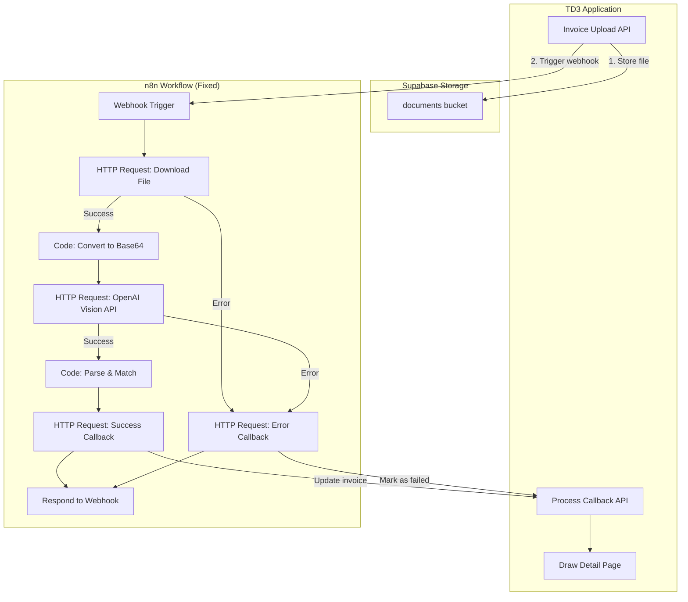

# Invoice Matching Fix - Deep Analysis & Comprehensive Plan

## Root Cause Analysis

### Issue 1: n8n Workflow Configuration Errors

**Problem:** The n8n workflow JSON uses incorrect node configurations:

```json
{
  "type": "@n8n/n8n-nodes-langchain.openAi",
  "operation": "analyze"  // ❌ This operation doesn't exist
}
```

The LangChain OpenAI node doesn't have an "analyze" operation. For vision/image analysis, you need to:

- Use the standard HTTP Request node to call OpenAI API directly
- Or use OpenAI node with proper message format including image_url

### Issue 2: Response Mode Without Error Handling

**Problem:** The webhook is configured with `responseMode: "responseNode"`:

- This means n8n waits for the "Respond" node to be reached
- If ANY node fails before reaching Respond, the response is empty
- The error callback node exists but has NO connections to it
```
Webhook → Download → OpenAI → Match → Callback → Respond
                                                    ↓
                                        Error Callback (UNCONNECTED!)
```


### Issue 3: Environment Variable Issues

**Problem:** The workflow uses:

```javascript
$env.TD3_API_URL || 'http://localhost:3000'
```

- n8n Cloud cannot reach `localhost:3000`
- TD3_API_URL must be set to the deployed URL in n8n

### Issue 4: Supabase Storage Access

**Problem:** The invoice files are uploaded to Supabase Storage but:

- The URL might not be publicly accessible
- The n8n HTTP Request node might not be able to fetch the file
- Need to ensure the storage bucket is public OR use signed URLs

---

## Solution Architecture



---

## Implementation Plan

### Phase 1: Fix n8n Workflow Structure

**File:** `n8n-workflows/td3-invoice-process.json`

#### 1.1 Replace OpenAI LangChain Node with HTTP Request

The OpenAI Vision API requires a specific format. Use HTTP Request node:

```javascript
// Node: OpenAI Vision API
{
  "method": "POST",
  "url": "https://api.openai.com/v1/chat/completions",
  "authentication": "genericCredentialType",
  "genericAuthType": "httpHeaderAuth",
  "sendHeaders": true,
  "headerParameters": {
    "parameters": [
      { "name": "Authorization", "value": "Bearer {{ $credentials.apiKey }}" }
    ]
  },
  "sendBody": true,
  "specifyBody": "json",
  "jsonBody": {
    "model": "gpt-4o",
    "messages": [
      {
        "role": "user",
        "content": [
          { "type": "text", "text": "Extract invoice data as JSON..." },
          { "type": "image_url", "image_url": { "url": "data:image/png;base64,{{ $json.base64 }}" } }
        ]
      }
    ],
    "max_tokens": 1000
  }
}
```

#### 1.2 Add Error Handling Flow

Connect error outputs from all nodes to the error callback:

```
Download ─── Error ───┐
OpenAI ─── Error ─────┤
Parse ─── Error ──────┼──→ Error Callback → Respond
Match ─── Error ──────┘
```

#### 1.3 Change Response Mode

Change from `responseNode` to `lastNode` OR ensure all paths lead to Respond:

```json
{
  "responseMode": "lastNode",  // Respond immediately with acknowledgment
  "responseCode": 200
}
```

### Phase 2: Fix TD3 Upload API

**File:** `app/api/invoices/upload/route.ts`

#### 2.1 Generate Signed URLs

Instead of public URLs, generate signed URLs that n8n can access:

```typescript
// Generate signed URL valid for 1 hour
const { data: signedUrlData, error: signedError } = await supabaseAdmin.storage
  .from('documents')
  .createSignedUrl(filePath, 3600) // 1 hour expiry

const fileUrl = signedError ? urlData.publicUrl : signedUrlData.signedUrl
```

#### 2.2 Improve Error Handling

Add timeout and retry logic for the n8n webhook call:

```typescript
// Trigger n8n with timeout
const controller = new AbortController()
const timeout = setTimeout(() => controller.abort(), 10000) // 10s timeout

try {
  const response = await fetch(webhookUrl, {
    method: 'POST',
    signal: controller.signal,
    // ...
  })
  clearTimeout(timeout)
  
  if (!response.ok) {
    throw new Error(`n8n returned ${response.status}`)
  }
} catch (err) {
  // Mark invoice for retry or manual processing
  await supabaseAdmin
    .from('invoices')
    .update({ status: 'pending', flags: 'PROCESSING_FAILED' })
    .eq('id', invoice.id)
}
```

### Phase 3: Update n8n Workflow JSON

**Complete rewrite of `n8n-workflows/td3-invoice-process.json`:**

See attached JSON below for the corrected workflow.

### Phase 4: Add Retry Mechanism

**New file:** `app/api/invoices/retry/route.ts`

Add endpoint to retry failed invoice processing:

```typescript
export async function POST(request: NextRequest) {
  const { invoiceId } = await request.json()
  
  // Get invoice
  const { data: invoice } = await supabaseAdmin
    .from('invoices')
    .select('*')
    .eq('id', invoiceId)
    .single()
  
  if (!invoice) return NextResponse.json({ error: 'Invoice not found' }, { status: 404 })
  
  // Re-trigger n8n processing
  // ...
}
```

### Phase 5: Add Processing Status Webhook

**New file:** `app/api/webhooks/invoice-status/route.ts`

Create a webhook endpoint that n8n can call to update status mid-processing:

```typescript
// Called by n8n to update status during long processing
export async function POST(request: NextRequest) {
  const { invoiceId, status, message } = await request.json()
  
  await supabaseAdmin
    .from('invoices')
    .update({ 
      status, 
      flags: message,
      updated_at: new Date().toISOString()
    })
    .eq('id', invoiceId)
  
  return NextResponse.json({ success: true })
}
```

---

## Environment Variables Required

### n8n Cloud Environment

Set these in n8n Cloud settings:

```
TD3_API_URL=https://your-td3-deployment.vercel.app
OPENAI_API_KEY=sk-...
```

### TD3 Application

Ensure these are set:

```
NEXT_PUBLIC_N8N_WEBHOOK_URL=https://grysngrhm.app.n8n.cloud/webhook
NEXT_PUBLIC_SUPABASE_URL=...
SUPABASE_SERVICE_ROLE_KEY=...
```

---

## Corrected n8n Workflow JSON

```json
{
  "name": "TD3 Invoice Process v2",
  "nodes": [
    {
      "parameters": {
        "httpMethod": "POST",
        "path": "td3-invoice-process",
        "responseMode": "lastNode",
        "options": {}
      },
      "name": "Webhook",
      "type": "n8n-nodes-base.webhook",
      "position": [220, 300]
    },
    {
      "parameters": {
        "method": "GET",
        "url": "={{ $json.fileUrl }}",
        "options": {
          "response": { "response": { "responseFormat": "file" } }
        }
      },
      "name": "Download File",
      "type": "n8n-nodes-base.httpRequest",
      "position": [440, 300],
      "continueOnFail": true
    },
    {
      "parameters": {
        "jsCode": "// Convert file to base64 for OpenAI Vision\nconst items = $input.all();\nconst webhookData = $('Webhook').first().json;\n\nif (items[0].error || !items[0].binary?.data) {\n  return [{\n    json: {\n      error: true,\n      invoiceId: webhookData.invoiceId,\n      message: 'Failed to download file'\n    }\n  }];\n}\n\nconst base64 = items[0].binary.data.data;\nconst mimeType = items[0].binary.data.mimeType || 'application/pdf';\n\nreturn [{\n  json: {\n    base64,\n    mimeType,\n    invoiceId: webhookData.invoiceId,\n    budgetCategories: webhookData.budgetCategories,\n    drawLines: webhookData.drawLines\n  }\n}];"
      },
      "name": "Convert to Base64",
      "type": "n8n-nodes-base.code",
      "position": [660, 300]
    },
    {
      "parameters": {
        "method": "POST",
        "url": "https://api.openai.com/v1/chat/completions",
        "authentication": "genericCredentialType",
        "genericAuthType": "httpHeaderAuth",
        "sendBody": true,
        "specifyBody": "json",
        "jsonBody": "={\n  \"model\": \"gpt-4o\",\n  \"messages\": [\n    {\n      \"role\": \"user\",\n      \"content\": [\n        {\n          \"type\": \"text\",\n          \"text\": \"Extract data from this construction invoice. Return JSON only:\\n{\\n  \\\"vendorName\\\": \\\"Company name\\\",\\n  \\\"invoiceNumber\\\": \\\"Invoice #\\\",\\n  \\\"invoiceDate\\\": \\\"YYYY-MM-DD\\\",\\n  \\\"totalAmount\\\": 0.00,\\n  \\\"constructionCategory\\\": \\\"Best guess: Electrical/Plumbing/HVAC/Framing/etc\\\"\\n}\\nIf value not found, use null.\"\n        },\n        {\n          \"type\": \"image_url\",\n          \"image_url\": {\n            \"url\": \"data:{{ $json.mimeType }};base64,{{ $json.base64 }}\"\n          }\n        }\n      ]\n    }\n  ],\n  \"max_tokens\": 1000,\n  \"temperature\": 0.1\n}",
        "options": {}
      },
      "name": "OpenAI Vision",
      "type": "n8n-nodes-base.httpRequest",
      "position": [880, 300],
      "continueOnFail": true,
      "credentials": {
        "httpHeaderAuth": { "id": "openai-api-key" }
      }
    },
    {
      "parameters": {
        "jsCode": "// Parse OpenAI response and match to categories\nconst input = $input.first().json;\nconst prevData = $('Convert to Base64').first().json;\n\n// Check for errors\nif (input.error || prevData.error) {\n  return [{ json: { error: true, invoiceId: prevData.invoiceId, message: input.error?.message || prevData.message || 'Processing failed' } }];\n}\n\n// Parse OpenAI response\nlet extracted;\ntry {\n  const content = input.choices?.[0]?.message?.content || '';\n  const jsonMatch = content.match(/\\{[\\s\\S]*\\}/);\n  extracted = jsonMatch ? JSON.parse(jsonMatch[0]) : {};\n} catch (e) {\n  return [{ json: { error: true, invoiceId: prevData.invoiceId, message: 'Failed to parse AI response' } }];\n}\n\n// Match to budget categories\nconst budgets = prevData.budgetCategories || [];\nconst drawLines = prevData.drawLines || [];\n\nlet bestMatch = null;\nlet bestScore = 0;\n\nconst normalize = s => (s || '').toLowerCase().replace(/[^a-z0-9]/g, '');\nconst similarity = (a, b) => {\n  a = normalize(a); b = normalize(b);\n  if (a === b) return 1;\n  if (a.includes(b) || b.includes(a)) return 0.8;\n  return 0;\n};\n\nfor (const budget of budgets) {\n  const score = Math.max(\n    similarity(extracted.constructionCategory, budget.category),\n    similarity(extracted.constructionCategory, budget.nahbCategory) * 0.9,\n    similarity(extracted.vendorName, budget.category) * 0.5\n  );\n  if (score > bestScore) { bestScore = score; bestMatch = budget; }\n}\n\nconst matchedLine = bestMatch ? drawLines.find(l => l.budgetId === bestMatch.id) : null;\n\nreturn [{\n  json: {\n    invoiceId: prevData.invoiceId,\n    success: true,\n    extractedData: {\n      vendorName: extracted.vendorName || 'Unknown',\n      invoiceNumber: extracted.invoiceNumber,\n      invoiceDate: extracted.invoiceDate,\n      amount: extracted.totalAmount || 0\n    },\n    matching: {\n      matchedCategory: bestMatch?.category || null,\n      matchedNahbCode: bestMatch?.nahbCategory || null,\n      matchedDrawLineId: matchedLine?.id || null,\n      confidenceScore: Math.round(bestScore * 100) / 100,\n      flags: bestScore < 0.7 ? ['LOW_CONFIDENCE'] : []\n    }\n  }\n}];"
      },
      "name": "Parse & Match",
      "type": "n8n-nodes-base.code",
      "position": [1100, 300]
    },
    {
      "parameters": {
        "conditions": {
          "boolean": [
            { "value1": "={{ $json.error }}", "value2": true }
          ]
        }
      },
      "name": "Check Error",
      "type": "n8n-nodes-base.if",
      "position": [1320, 300]
    },
    {
      "parameters": {
        "method": "POST",
        "url": "={{ $env.TD3_API_URL }}/api/invoices/process-callback",
        "sendBody": true,
        "specifyBody": "json",
        "jsonBody": "={{ JSON.stringify($json) }}"
      },
      "name": "Success Callback",
      "type": "n8n-nodes-base.httpRequest",
      "position": [1540, 200]
    },
    {
      "parameters": {
        "method": "POST",
        "url": "={{ $env.TD3_API_URL }}/api/invoices/process-callback",
        "sendBody": true,
        "specifyBody": "json",
        "jsonBody": "={{ JSON.stringify({ invoiceId: $json.invoiceId, success: false, error: $json.message || 'Processing failed' }) }}"
      },
      "name": "Error Callback",
      "type": "n8n-nodes-base.httpRequest",
      "position": [1540, 400]
    },
    {
      "parameters": {
        "respondWith": "json",
        "responseBody": "={{ JSON.stringify({ received: true, invoiceId: $('Webhook').first().json.invoiceId }) }}"
      },
      "name": "Respond",
      "type": "n8n-nodes-base.respondToWebhook",
      "position": [1760, 300]
    }
  ],
  "connections": {
    "Webhook": { "main": [[{ "node": "Download File" }]] },
    "Download File": { "main": [[{ "node": "Convert to Base64" }]] },
    "Convert to Base64": { "main": [[{ "node": "OpenAI Vision" }]] },
    "OpenAI Vision": { "main": [[{ "node": "Parse & Match" }]] },
    "Parse & Match": { "main": [[{ "node": "Check Error" }]] },
    "Check Error": { 
      "main": [
        [{ "node": "Error Callback" }],
        [{ "node": "Success Callback" }]
      ]
    },
    "Success Callback": { "main": [[{ "node": "Respond" }]] },
    "Error Callback": { "main": [[{ "node": "Respond" }]] }
  }
}
```

---

## Testing Plan

1. **Deploy n8n workflow** - Import corrected JSON and activate
2. **Set environment variables** - TD3_API_URL and OPENAI credentials in n8n
3. **Test with sample invoice** - Upload a clear PDF/image invoice
4. **Monitor n8n executions** - Check for errors in execution history
5. **Verify callback updates** - Check that invoice status updates in DB
6. **Test error handling** - Upload invalid file to verify error path works

---

## Todos

- [ ] Update n8n workflow with corrected configuration
- [ ] Add signed URL generation in upload API  
- [ ] Add retry endpoint for failed invoices
- [ ] Set TD3_API_URL in n8n Cloud environment
- [ ] Test end-to-end with real invoice
- [ ] Add processing status indicator improvements