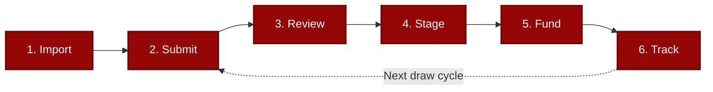

# TD3

**Draw Management Built for How We Actually Work**

[td3.tennantdevelopments.com](https://td3.tennantdevelopments.com)

TD3 is an internal system that brings order to construction loan servicing. It replaces scattered spreadsheets, buried emails, and manual reconciliation with a single place where every loan, budget, draw, and approval is visible, trackable, and auditable.

This isn't about adopting more software. It's about reducing the mental overhead of keeping everything straight---so we can focus on decisions instead of data entry.

---

## Why TD3

| Challenge | TD3 Solution |
|-----------|--------------|
| Hours compiling reports from scattered spreadsheets | Real-time dashboards, zero compilation |
| Manual invoice matching, one line at a time | AI matches invoices in seconds |
| Audit prep means detective work | Complete audit trail writes itself |
| Budget categories inconsistent across loans | AI standardizes to NAHB codes automatically |
| Funding status lives in someone's head | Wire batch tracking with full history |

---

## The Problem

Construction lending runs on a lot of moving pieces---budgets, draw requests, approvals, invoices, wire details---and standard office tools spread that information across many places.

### Fragmented Information

When loan data lives in spreadsheets, email threads, and personal notes, routine tasks take longer than they need to:

- **Version ambiguity.** Multiple copies of a budget spreadsheet make it unclear which is current.
- **Scattered context.** Approvals and exceptions discussed over email are difficult to reconstruct months later.
- **Manual reporting.** Compiling a portfolio status means pulling data from several sources and reconciling by hand.
- **Audit overhead.** Demonstrating the history of a loan means assembling records from many places.

### Repetitive Manual Work

A significant share of operational hours goes to tasks that are mechanical rather than analytical:

- **Budget categorization.** Every new project means classifying line items individually, with natural variation across loans.
- **Invoice matching.** Each draw request means comparing invoices to budget categories, checking amounts, and flagging mismatches one at a time.
- **Data re-entry.** Moving numbers between systems takes time that could go toward analysis and decision-making.

TD3 automates these processes so the team can operate more efficiently and more profitably with the same workload.

---

## The Solution

TD3 addresses both problems directly: **one place for everything** and **automation for the repetitive stuff**.

### A Single Source of Truth

Every loan, builder, budget, draw request, invoice, and approval lives in one system. Not spreadsheets with version numbers in the filename---a real database that stays current.

This means:

- **The current state is always obvious.** Open the dashboard and see exactly where things stand---across the portfolio or for any individual loan.
- **History is preserved automatically.** Every change, every approval, every upload is timestamped and attributed. The audit trail writes itself.
- **Reporting is instant.** No more compiling. The data is already structured. Generate reports in seconds, not hours.
- **Anyone can pick up where someone else left off.** Context isn't trapped in someone's head or inbox. It's in the system.

When the current state is obvious, less mental energy goes to "wait, where is that?" and more goes to actual decisions.

### Intelligent Automation Where It Matters

TD3 uses AI to handle the tedious, repetitive tasks that currently eat hours:

- **Automatic budget standardization.** Upload a builder's budget spreadsheet, and AI classifies each line item to industry-standard NAHB cost codes. Consistent categorization across every project, every time.
- **Smart invoice matching.** Upload invoices with a draw request, and AI extracts vendor names, amounts, and descriptions---then matches them to the right budget lines automatically.
- **Built-in validation.** The system flags over-budget requests, duplicate invoices, and missing documentation before you even see them. Problems surface early, not after funding.

The key insight: AI handles the pattern matching and data extraction. Humans review the results and make decisions. Tasks that took hours complete in seconds---with better consistency.

---

## How It Works

The day-to-day workflow is straightforward:

1. **Import** --- Upload a builder's budget spreadsheet. TD3 detects categories and amounts, you confirm the mapping, and AI standardizes everything to NAHB cost codes.

2. **Submit** --- When a draw comes in, upload the request. AI matches draw amounts to existing budget lines automatically.

3. **Review** --- See the full picture: amounts, budget status, flags, invoices. Resolve any issues directly in the interface.

4. **Stage** --- Approved draws move to staging. See all staged draws grouped by builder, ready for funding.

5. **Fund** --- Select a funding date, add wire reference if needed, and mark draws as funded with one click. The system handles the rest.

6. **Track** --- Dashboards show real-time status across the portfolio. Budget utilization, draw history, amortization schedules---all visible without compiling anything.

---

## What TD3 Covers

| Area | What It Does | Details |
|------|-------------|---------|
| Portfolio Visibility | Dual dashboards, smart filtering, risk indicators, builder timelines | [Architecture: System Overview](docs/ARCHITECTURE.md#system-architecture) |
| Loan Lifecycle | Origination through payoff with stage-specific views and metrics | [Architecture: Loan Lifecycle](docs/ARCHITECTURE.md#loan-lifecycle-management) |
| Budget Intelligence | AI categorization to NAHB codes, inline editing, import protection | [Architecture: Budget Intelligence](docs/ARCHITECTURE.md#budget-intelligence) |
| Draw Processing | Multi-stage workflow with fuzzy matching and automated validation | [Architecture: Draw Workflow](docs/ARCHITECTURE.md#draw-processing-workflow) |
| Wire Batches | Consolidated builder payments with funding reports and audit trail | [Architecture: Wire Batches](docs/ARCHITECTURE.md#wire-batch-funding) |
| Invoice Matching | AI extraction, deterministic scoring, and a learning feedback loop | [Architecture: Invoice Matching](docs/ARCHITECTURE.md#invoice-matching) |
| Financial Calculations | Compound interest, fee escalation, IRR, payoff projections | [Architecture: AI Integration](docs/ARCHITECTURE.md#ai-integration) |
| Compliance & Audit | Immutable records, timestamped actions, document verification | [Architecture: Security Model](docs/ARCHITECTURE.md#security-model) |

---

## Security & Compliance

TD3 uses passwordless authentication with a pre-authorized access list, so only approved team members can sign in---no passwords to manage or compromise. Four stackable permissions control exactly what each user can do, enforced at the database level through row-level security. Every action is recorded in an immutable audit trail with timestamps and user attribution. For the full security model, see [Architecture: Security Model](docs/ARCHITECTURE.md#security-model).

---

## What's Next

The platform is live and operational. Upcoming work focuses on reducing manual handoffs that still happen outside TD3---electronic signature integration for loan documents, interactive notification cards for approvals and funding requests, and dedicated portals so builders and lenders can access their own data directly. See the [Development Roadmap](docs/ROADMAP.md) for the full timeline and feature details.

---

## Documentation

| Document | Description |
|----------|-------------|
| [Technical Architecture](docs/ARCHITECTURE.md) | System design, platform capabilities, and security model |
| [Development Roadmap](docs/ROADMAP.md) | Upcoming features and timeline |
| [Design Language](docs/DESIGN_LANGUAGE.md) | UI/UX standards, color system, and component patterns |

---

## About

**Tennant Developments** --- Real estate development and construction finance, based in Central Oregon.

For questions, demos, or feedback, contact **Grayson Graham**.

---

*© 2024-2026 Tennant Developments. Proprietary software --- all rights reserved.*
