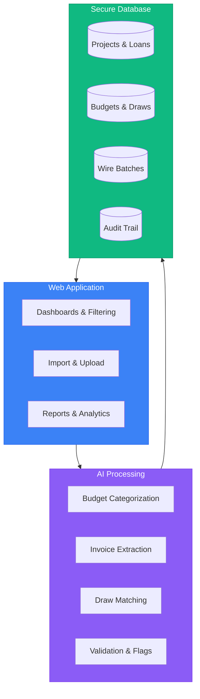

# TD3

**Draw Management Built for How We Actually Work**

[td3.tennantdevelopments.com](https://td3.tennantdevelopments.com)

TD3 is an internal system that brings order to construction loan servicing. It replaces scattered spreadsheets, buried emails, and manual reconciliation with a single place where every loan, budget, draw, and approval is visible, trackable, and auditable.

This isn't about adopting more software. It's about reducing the mental overhead of keeping everything straight—so we can focus on decisions instead of data entry.

---

## Why TD3

| Challenge | TD3 Solution |
|-----------|--------------|
| Hours compiling reports from scattered spreadsheets | Real-time dashboards, zero compilation |
| Manual invoice matching, one line at a time | AI matches invoices in seconds |
| Audit prep means detective work | Complete audit trail writes itself |
| Budget categories inconsistent across loans | AI standardizes to NAHB codes automatically |
| Funding status lives in someone's head | Wire batch tracking with full history |

---

## The Problem

Construction lending operations create two persistent challenges that compound as the portfolio grows.

### Everything Lives in Too Many Places

Right now, understanding the state of a single loan requires checking multiple sources: the budget or draw spreadsheet that someone emailed last month, approval threads buried in inboxes, handwritten sticky notes from phone calls, and whatever information someone is keeping track of in their head happens to be.

This fragmentation creates real problems:

- **No single source of truth.** Budget data exists in different Excel files on different machines, each slightly different. Which one is current? Who knows.
- **Decisions disappear into email.** Approvals, exceptions, and important context get trapped in individual inboxes. When questions arise later, reconstructing what happened means hunting through threads.
- **Reporting takes hours.** Compiling a simple portfolio status means pulling data from multiple places, re-keying numbers, and hoping nothing got missed.
- **Audits are painful.** When we need to show our work, piecing together the timeline of a loan means detective work, not documentation.

A small team can hold all this in their heads, until they can't. The system doesn't scale down gracefully, and it definitely doesn't scale up.

### Too Much Time on Repetitive Work

Even with good intentions and smart people, manual processes eat time that should go elsewhere:

- **Budget categorization is tedious.** Every new project means manually classifying line items, often inconsistently across loans.
- **Invoice matching is slow.** Each draw request requires manually matching invoices to budget categories, one by one, checking amounts, flagging mismatches.
- **Data entry crowds out judgment.** Hours spent re-keying numbers is hours not spent on analysis, risk assessment, or builder relationships.
- **Inconsistency undermines reporting.** When every loan is categorized slightly differently, portfolio-level insights become unreliable.

The work gets done, but it takes longer than it should, and it's harder to trust.

---

## The Solution

TD3 addresses both problems directly: **one place for everything** and **automation for the repetitive stuff**.

### A Single Source of Truth

Every loan, builder, budget, draw request, invoice, and approval lives in one system. Not spreadsheets with version numbers in the filename—a real database that stays current.

This means:

- **The current state is always obvious.** Open the dashboard and see exactly where things stand—across the portfolio or for any individual loan.
- **History is preserved automatically.** Every change, every approval, every upload is timestamped and attributed. The audit trail writes itself.
- **Reporting is instant.** No more compiling. The data is already structured. Generate reports in seconds, not hours.
- **Anyone can pick up where someone else left off.** Context isn't trapped in someone's head or inbox. It's in the system.

When the current state is obvious, less mental energy goes to "wait, where is that?" and more goes to actual decisions.

### Intelligent Automation Where It Matters

TD3 uses AI to handle the tedious, repetitive tasks that currently eat hours:

- **Automatic budget standardization.** Upload a builder's budget spreadsheet, and AI classifies each line item to industry-standard NAHB cost codes. Consistent categorization across every project, every time.
- **Smart invoice matching.** Upload invoices with a draw request, and AI extracts vendor names, amounts, and descriptions—then matches them to the right budget lines automatically.
- **Built-in validation.** The system flags over-budget requests, duplicate invoices, and missing documentation before you even see them. Problems surface early, not after funding.

The key insight: AI handles the pattern matching and data extraction. Humans review the results and make decisions. Tasks that took hours complete in seconds—with better consistency.

---

## How It Works

The day-to-day workflow is straightforward:

1. **Import** — Upload a builder's budget spreadsheet. TD3 detects categories and amounts, you confirm the mapping, and AI standardizes everything to NAHB cost codes.

2. **Submit** — When a draw comes in, upload the request. AI matches draw amounts to existing budget lines automatically.

3. **Review** — See the full picture: amounts, budget status, flags, invoices. Resolve any issues directly in the interface.

4. **Stage** — Approved draws move to staging. See all staged draws grouped by builder, ready for funding.

5. **Fund** — Select a funding date, add wire reference if needed, and mark draws as funded with one click. The system handles the rest.

6. **Track** — Dashboards show real-time status across the portfolio. Budget utilization, draw history, amortization schedules—all visible without compiling anything.

---

## Capabilities

### Portfolio Visibility

Real-time insight without manual compilation.

- **Dual Dashboards** — Portfolio Dashboard for high-level overview; Draw Dashboard for daily funding operations
- **Smart Filtering** — 3-way toggle (Builder/Subdivision/Lender) with cascading filters and URL-based deep linking
- **Stage-Specific Metrics** — Dynamic stats showing relevant KPIs per lifecycle stage (pipeline value, utilization, IRR)
- **Builder Timeline** — Interactive Gantt and spreadsheet views grouped by lender
- **Risk Indicators** — Color-coded LTV warnings (green, yellow, red) and maturity alerts

### Loan Lifecycle

Complete tracking from origination through payoff.

- **Loan Origination** — Create loans with inline editing, default term sheets, and auto-generated project codes
- **Builder Management** — Dedicated builder pages with company info, banking details, contact links, and portfolio views
- **Multi-Lender Support** — Track loans across lenders (TD2, TenBrook, Tennant) with proper separation
- **Lifecycle Transitions** — Checkbox-driven state changes with validation gates

### Budget Intelligence

AI-powered standardization across your entire portfolio.

- **Smart Import** — Upload Excel/CSV with intelligent column detection, row boundary recognition, and formatting preservation
- **NAHB Categorization** — AI maps line items to 16 categories and 118 subcategories with accuracy ratings
- **Inline Editing** — Cascading Category → Subcategory dropdowns with real-time calculations
- **Budget Protection** — Funded draws preserve data; smart merge handles reimports; $0 placeholders supported
- **Dynamic Expansion** — Create new budget lines directly from draw review when categories don't match

### Draw Workflow

Multi-stage funding process with complete tracking.

- **Intelligent Matching** — Fuzzy matching of draw categories to budgets with manual override dropdowns
- **Wire Batch System** — Group draws by builder for single wire transfers with funding reports
- **Invoice Processing** — Drag-drop upload, AI extraction, thumbnail gallery, split-view PDF preview
- **Automated Validation** — Flag over-budget requests, duplicate invoices, missing docs, low-confidence matches
- **Unstage Capability** — Reverse staging decisions before funding when needed

### Financial Precision

Accurate calculations matching your existing formulas.

- **Compound Interest Amortization** — Draw-by-draw interest calculation with automatic fee tracking
- **Interactive Payoff Calculator** — Real-time statements with what-if scenarios and per diem rates
- **Title Company Reports** — Professional payoff letters with credits management and good-through dates
- **Fee Escalation Tracking** — Flexible fee schedules by project or lender
- **Three Report Types** — Budget (Sankey flow, utilization), Amortization (balance growth, timeline), Payoff (projection, what-if)
- **Anomaly Detection** — Automated flagging of spending spikes and budget variances

### Compliance Built-In

Audit-ready from day one.

- **Complete Audit Trail** — Every action logged with timestamps and user attribution
- **Immutable Records** — Historical data cannot be altered, only appended
- **Wire References** — Funding dates and reference numbers tracked per batch
- **Document Storage** — Categorized document upload with duplicate detection
- **Approval Tracking** — Full history of who approved what and when

---

## System Architecture

Users interact with a clean web interface, AI handles tedious processing, and everything lands in a structured database.

**Why this structure matters:**
- User actions flow through a consistent interface—no direct database access, no spreadsheet chaos
- AI processing is isolated and auditable—you can see what it did and correct it if needed
- The database preserves everything—history, relationships, audit trail—automatically

---

## Security and Compliance

- **Complete Audit Trail** — Every action logged with timestamps and user attribution
- **Role-Based Access** — Configurable permissions and approval workflows
- **Data Integrity** — Immutable audit records prevent tampering
- **Enterprise Database** — PostgreSQL with row-level security capabilities
- **Document Verification** — Duplicate detection prevents accidental double-processing
- **Compliant Infrastructure** — Built on SOC 2 certified hosting

---

## Documentation

| Document | Description |
|----------|-------------|
| [Technical Architecture](docs/ARCHITECTURE.md) | System design, platform capabilities, and security model |
| [Development Roadmap](docs/ROADMAP.md) | Upcoming features and timeline |
| [Design Language](docs/DESIGN_LANGUAGE.md) | UI/UX standards, color system, and component patterns |

---

## About

**Tennant Developments** — Real estate development and construction finance, based in Central Oregon.

For questions, demos, or feedback, contact **Grayson Graham**.

---

*© 2024-2026 Tennant Developments. Proprietary software — all rights reserved.*
