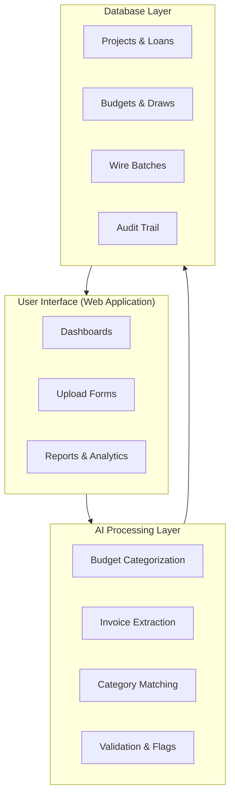
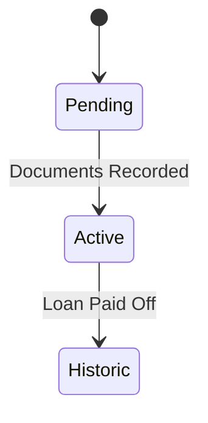
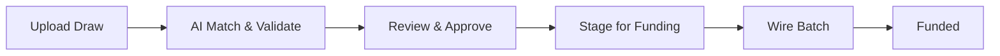
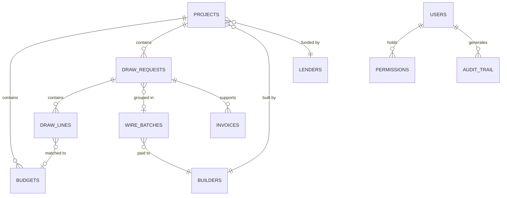

# TD3 Technical Architecture

## Overview

TD3 is a construction loan management platform that replaces fragmented spreadsheet workflows with a unified system for tracking loans, budgets, draws, and wire transfers. The platform combines a modern web interface with AI-powered automation and a secure relational database.

---

## System Architecture

The system is organized into three layers:

- **User Interface** -- A server-rendered web application with client-side interactivity. Users interact with dashboards for portfolio management, upload forms for importing budgets and invoices, and polymorphic report views that present data as tables, charts, or formatted documents.

- **AI Processing Layer** -- An external automation engine handles computationally intensive tasks: categorizing budget line items against industry-standard cost codes, extracting structured data from uploaded invoice PDFs, matching invoices to draw request lines, and generating validation flags for human review.

- **Database Layer** -- A managed relational database with row-level security stores all business data. Every entity change is recorded in an immutable audit trail, ensuring complete traceability of financial transactions.

---

## Core Platform

### Loan Lifecycle Management

Every construction loan progresses through three stages:

- **Pending** -- Loan origination. Term sheet fields are entered, the builder and lender are linked, and documents are prepared for execution.
- **Active** -- The loan is funded and in progress. Budgets are tracked, draws are processed, and the amortization schedule accrues interest in real time.
- **Historic** -- The loan has been paid off. All data is preserved as an immutable record for performance analysis and auditing.

The platform supports multiple builders and lenders, with each loan linking to a builder entity that carries banking information for wire transfers.

### Budget Intelligence

When a builder's budget spreadsheet is uploaded, the system automatically detects column headers and row boundaries, then sends line items to the AI processing layer for categorization against NAHB industry-standard cost codes (16 major categories, 118 subcategories).

Users can review and adjust AI-suggested categories through cascading dropdowns before approving the budget. Once draws are funded against a budget line, that line is protected from deletion during re-imports.

### Draw Processing Workflow

Draw requests follow a structured workflow:

1. **Upload** -- The draw spreadsheet is imported and individual line items are created.
2. **AI Match & Validate** -- Each line item is fuzzy-matched to the corresponding budget category. Validation flags are generated for issues such as over-budget requests, missing invoices, or unmatched categories.
3. **Review & Approve** -- A processor reviews flagged items, adjusts amounts, and approves the draw.
4. **Stage for Funding** -- Approved draws are grouped by builder into wire batches.
5. **Wire Batch** -- The batch is sent to the bookkeeper for wire processing with a detailed funding report.
6. **Funded** -- Once the wire is confirmed, budget spent amounts are atomically updated and the draw is locked as an immutable record.

### Wire Batch Funding

Wire batches consolidate multiple draws for the same builder into a single wire transfer. This reduces banking fees and simplifies bookkeeping. Each batch includes:

- A funding report with per-draw breakdowns
- Builder banking information for the wire
- Status tracking from creation through confirmation
- Complete audit trail of all actions

### Invoice Matching

The invoice system uses a two-stage architecture:

1. **AI Extraction** -- Uploaded invoice PDFs are sent to the AI processing layer, which extracts vendor name, amount, description, trade signals, and keywords.
2. **Deterministic Matching** -- The application scores extracted data against open draw request lines using weighted factors (amount similarity, trade alignment, keyword overlap, and historical vendor patterns).

High-confidence matches are applied automatically. Ambiguous cases are flagged for human review. Every match decision (automatic or manual) is recorded for auditing, and approved matches feed back into a learning system that improves future accuracy.

---

## AI Integration

The platform integrates AI capabilities through an external automation engine that handles:

- **Budget Categorization** -- Mapping builder-specific line items to standardized industry cost codes with confidence scoring.
- **Invoice Data Extraction** -- Converting unstructured invoice PDFs into structured data (vendor, amount, description, trade classification).
- **Draw Validation** -- Generating flags for anomalies such as over-budget requests, amount mismatches between invoices and draw lines, and missing documentation.
- **Disambiguation** -- When multiple budget lines are viable matches for an invoice, a narrow AI selection step chooses among pre-validated candidates.

All AI decisions are transparent and auditable. The system is designed so that AI reads and extracts, while the application reasons and decides.

---

## Security Model

- **Passwordless authentication** via one-time codes sent to email, eliminating password-related vulnerabilities
- **Pre-authorized access list** controls who can sign in -- only approved email addresses are accepted
- **Four stackable permissions** control what authenticated users can do:
  - Process loans (create, edit, delete business records)
  - Fund draws (transition draws and wire batches to funded status)
  - Approve payoffs (authorize payoff statements before sending to title companies)
  - Manage users (administer access list and permissions)
- **Row-level database security** enforces access rules at the data layer, independent of the application
- **Complete audit trail** records every action with timestamps and user attribution
- **Immutable historical records** prevent modification of funded draws and completed transactions
- **Webhook authentication** uses cryptographic verification with fail-closed semantics

---

## Data Architecture

The data model centers on **Projects** (loans), which link to **Builders** and **Lenders**. Each project has a set of **Budgets** (categorized line items) and **Draw Requests** (funding requests). Draw request lines are matched to budget categories and supported by **Invoices**. When draws are approved, they are grouped into **Wire Batches** by builder for consolidated payment.

All user actions flow through a permissions system and are recorded in an immutable **Audit Trail**.

---

## Deployment

- **Continuous integration** with automated builds and type checking on every push
- **Staging environment** with preview deployments for pre-production testing
- **Production deployments** triggered automatically on merge to the main branch
- **Enterprise-grade hosting** with edge network distribution and automatic scaling
- **Managed database** with automated backups, point-in-time recovery, and connection pooling

---

*TD3 Technical Architecture -- Last updated: February 2026*
