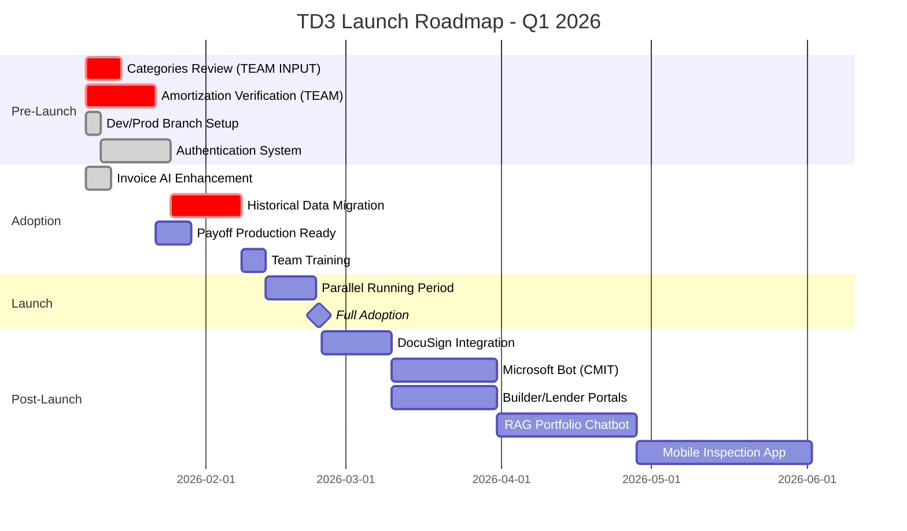
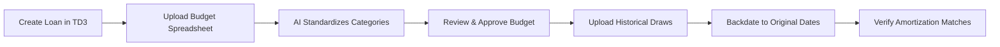
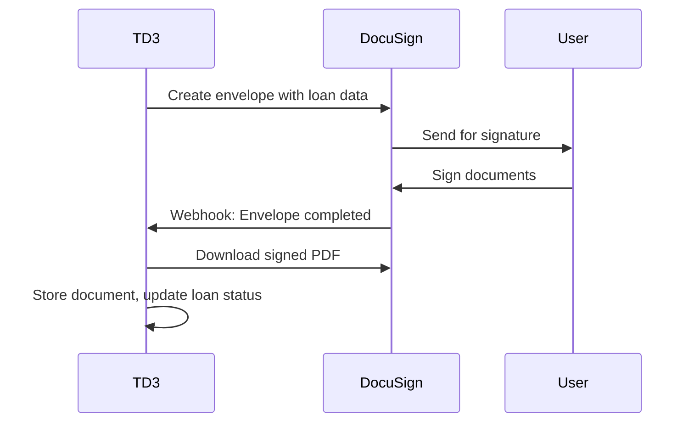
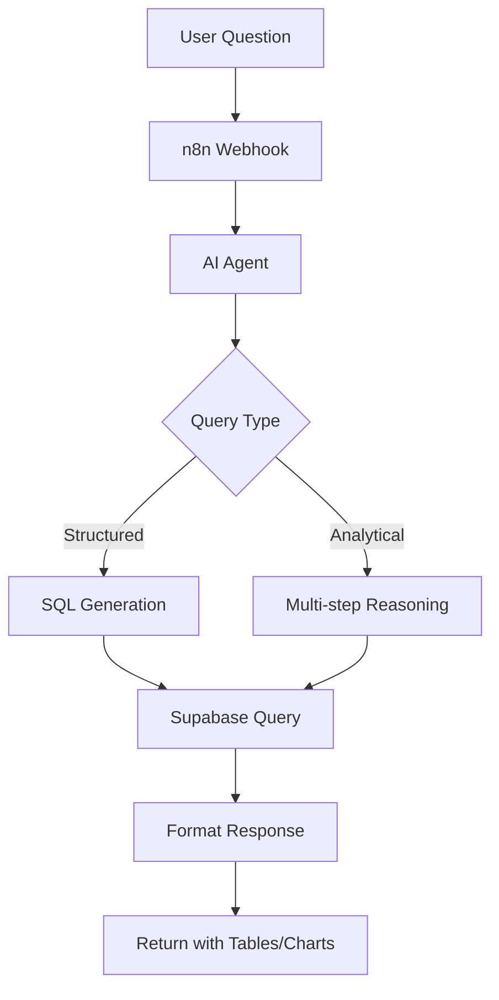
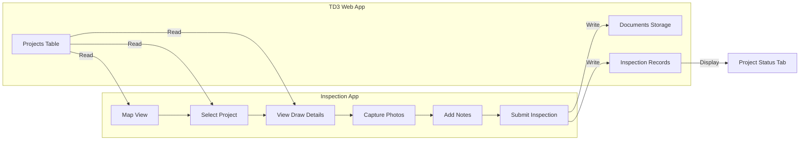
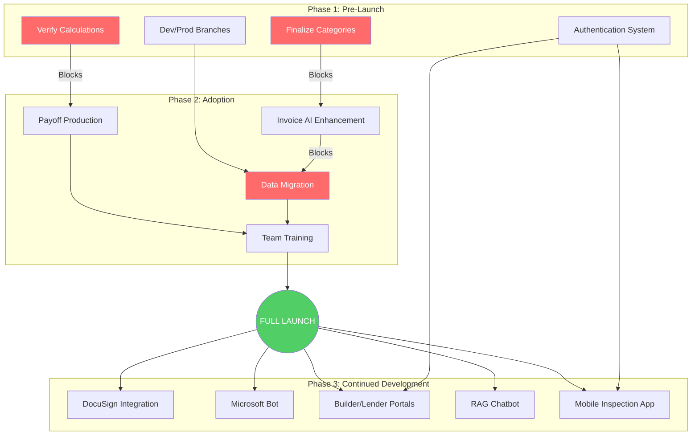

# TD3 Development Roadmap

**Version:** 1.4
**Last Updated:** February 5, 2026
**Target Launch:** Q1 2026
**Status:** Core Platform Complete - Ready for Data Migration

---

## Executive Summary

TD3 is ready to transition from development to production use. This roadmap outlines the path from our current functional state to full adoption, replacing legacy Excel-based systems with a unified construction loan management platform.

### Purpose of This Document

This roadmap serves two purposes:
1. **Map the development path** from current state through full launch and beyond
2. **Identify where team cooperation is required** so we can move forward together

### What the Team Needs to Do

**Development cannot proceed past certain points without team input.** The following items require decisions or verification from the team before we can continue:

| Required Input | Who | When Needed | Time Commitment |
|----------------|-----|-------------|-----------------|
| **Review budget categories** | Team Lead | Week 1 | 1-2 hour meeting |
| **Verify payoff calculations** | Finance | Weeks 1-2 | 2-3 hours comparing to legacy |
| **Define invoice review flags** | Operations | Week 2 | 30-minute discussion |
| **Verify migrated data** | Team Lead | Week 5 | 1-2 hours spot-checking |
| **Complete training** | All Staff | Week 8 | 2-3 hours over 1 week |

**Without these inputs, we cannot migrate historical data or go live.** The specific questions and verification steps are detailed in each section below.

### Current State Assessment

TD3 is **substantially complete** for core functionality:

| Area | Status | Notes |
|------|--------|-------|
| Loan Lifecycle Management | ✅ Complete | Pending → Active → Historic |
| Budget Import & AI Categorization | ✅ Complete | NAHB cost codes, n8n workflows |
| Draw Request Processing | ✅ Complete | Full workflow with staging |
| Financial Calculations | ✅ Complete | Amortization, payoff, IRR |
| Wire Batch Funding | ✅ Complete | Builder grouping, audit trail |
| Invoice AI Matching | ✅ Complete | Deterministic scoring, narrow AI, learning |
| User Authentication | ✅ Complete | OTP code auth, allowlist, stackable permissions, RLS |
| Welcome Page & Login | ✅ Complete | Apple-style landing page with scroll-driven animations |
| User Preferences | ✅ Complete | Theme, font size, reduced motion, default dashboard (`lib/preferences.ts`) |
| Activity Tracking | ✅ Complete | Login events, entity mutations, device metadata (`lib/activity.ts`) |
| Account Settings | ✅ Complete | Profile, preferences, activity tabs at `/account` |
| DocuSign Integration | ❌ Not Started | Placeholder in origination |
| External Portals | ❌ Not Started | Builder/lender access |

### Critical Path to Launch

```
Categories Finalized → Data Migration → Full Adoption
         ↓
Calculations Verified → Payoff Production Ready
```

**Key Insight:** Team input on categories and calculation verification are the primary blockers. Authentication is complete, so development can proceed in parallel. Data migration cannot begin until categories are finalized.

### Three-Phase Approach

| Phase | Timeline | Focus | Team Involvement |
|-------|----------|-------|------------------|
| **Pre-Launch** | Weeks 1-6 | Finalize database, verify calculations | Category review, calculation sign-off |
| **Adoption** | Weeks 7-12 | Migrate data, enhance AI, train team | Data verification, training participation |
| **Continued Development** | Post-Launch | Add advanced features (DocuSign, portals, mobile app) | Feature prioritization feedback |

### Estimated Costs

- **Development:** ~135-172 hours total (AI-assisted development)
- **Monthly Operations:** $52-58 base, up to $112-148 with all features
- **External:** ~$500 one-time for Microsoft Bot (CMIT coordination)

---

## Table of Contents

- [Timeline Overview](#timeline-overview)
- **Phase 1: Pre-Launch**
  - [1.1 Finalize Categories & Subcategories](#11-finalize-categories--subcategories)
  - [1.2 Verify Amortization & Payoff Calculations](#12-verify-amortization--payoff-calculations)
  - [1.3 Authentication System](#13-authentication-system-internal-staff)
  - [1.4 Dev/Prod Branch Setup](#14-devprod-branch-setup)
- **Phase 2: Adoption**
  - [2.1 Enhanced Invoice AI Workflow](#21-enhanced-invoice-ai-workflow)
  - [2.2 Historical Data Migration](#22-historical-data-migration)
  - [2.3 Payoff Production for Title Companies](#23-payoff-production-for-title-companies)
  - [2.4 Team Training & Parallel Running](#24-team-training--parallel-running)
- **Phase 3: Continued Development**
  - [3.1 DocuSign API Integration](#31-docusign-api-integration)
  - [3.2 Microsoft Adaptive Cards Bot](#32-microsoft-adaptive-cards-bot)
  - [3.3 Builder & Lender Portals](#33-builder--lender-portals)
  - [3.4 RAG Portfolio Chatbot](#34-rag-portfolio-chatbot)
  - [3.5 Mobile Inspection App](#35-mobile-inspection-app)
- [Dependency Flow](#dependency-flow)
- [Cost Estimates](#cost-estimates)
- [Team Input Requirements](#team-input-requirements)
- [Risk Assessment](#risk-assessment)
- [Success Metrics](#success-metrics)

---

## Timeline Overview



---

## Phase 1: Pre-Launch (Weeks 1-6)

**Objective:** Finalize database structure, verify calculations, and establish secure access before any production data enters the system.

### 1.1 Finalize Categories & Subcategories

| Attribute | Value |
|-----------|-------|
| **Priority** | CRITICAL - Blocks all data migration |
| **Team Input Required** | YES |
| **Estimated Duration** | 1 week |
| **Owner** | Team Lead + Development |

**Current State:**
- 16 NAHB major categories implemented
- 118 subcategories with cost codes (0100-1699)
- AI categorization workflow functional

**Team Decision Required:**

> **QUESTION 1:** Which broad categories are most useful for budget review and comparison?
> 
> Current categories: General Conditions, Site Work, Concrete & Foundations, Framing, Roofing, Exterior Finishes, Windows & Doors, Plumbing, HVAC/Mechanical, Electrical & Low Voltage, Insulation & Drywall, Interior Finishes, Flooring, Countertops, Appliances, Landscaping & Exterior Amenities

> **QUESTION 2:** Are there builder categories you frequently see that don't fit well into current subcategories?
> 
> Example gaps to consider: Solar/EV charging, ADU-specific items, Pool/spa, Smart home systems

> **QUESTION 3:** Are any current subcategories redundant or confusing?
> 
> For instance: "Interior Trim" vs "Finish Carpentry" - should these be combined?

**Deliverable:** Finalized category taxonomy document signed off by team

---

### 1.2 Verify Amortization & Payoff Calculations

| Attribute | Value |
|-----------|-------|
| **Priority** | CRITICAL - Blocks payoff production |
| **Team Input Required** | YES |
| **Estimated Duration** | 1-2 weeks |
| **Owner** | Finance Team + Development |

**Current Implementation:**

TD3 uses **compound interest** with accrual at two trigger points:
1. Last day of each calendar month
2. When a new draw is funded

**Fee Escalation Formula (from `lib/loanTerms.ts`):**

| Month | Fee Rate | Type |
|-------|----------|------|
| 1-6 | 2.00% | Base |
| 7 | 2.25% | Escalation begins |
| 8-12 | +0.25%/month | Escalation |
| 13 | 5.90% | Extension jump |
| 14+ | +0.40%/month | Post-extension |

**Verification Process:**

```
Step 1: Select 3-5 representative loans from legacy system
        - Include at least one loan in months 1-6
        - Include at least one loan in months 7-12
        - Include at least one extension loan (13+ months)

Step 2: Enter same data into TD3
        - Loan terms, start date
        - All funded draws with dates

Step 3: Compare outputs
        - Principal balance
        - Accrued interest (day count and amount)
        - Per diem rate
        - Finance fee at current month
        - Total payoff amount

Step 4: Document any discrepancies
        - Identify root cause
        - Determine which calculation is correct
        - Adjust TD3 or document why legacy is wrong
```

**Deliverable:** Signed verification document confirming TD3 calculations match expected results

---

### 1.3 Authentication System (Internal Staff)

| Attribute | Value |
|-----------|-------|
| **Priority** | HIGH - Enables secure production use |
| **Team Input Required** | No |
| **Estimated Duration** | 2-3 weeks |
| **Owner** | Development |
| **Status** | ✅ COMPLETE (Jan 18, 2026) |

**Implementation Summary:**

TD3 now uses **passwordless authentication** with stackable permissions:

1. **Supabase Auth** - OTP code (passwordless) login
2. **Allowlist-Based Access** - Only pre-approved emails can sign in
3. **Stackable Permissions** - Four independent permissions, any combination
4. **Row Level Security (RLS)** - Database-level access control

**Permission System (Implemented):**

| Permission Code | Label | Controls |
|-----------------|-------|----------|
| `processor` | Loan Processor | INSERT/UPDATE/DELETE on business tables |
| `fund_draws` | Fund Draws | Transition draws/batches to 'funded' status |
| `approve_payoffs` | Approve Payoffs | Approve payoffs before sending to title |
| `users.manage` | Manage Users | Access to /admin/users, manage allowlist |

**Key Features Implemented:**

- **Middleware route protection** - Redirects unauthenticated users to `/login`
- **AuthContext** - Global auth state (user, profile, permissions)
- **PermissionGate component** - Declarative permission-based UI rendering
- **FirstLoginModal** - Prompts new users to complete profile (name, phone)
- **Admin user management** - `/admin/users` for managing users and permissions
- **Header integration** - User avatar dropdown with sign out

**Database Changes Applied:**
- New tables: `profiles`, `permissions`, `user_permissions`, `allowlist`
- Helper functions: `has_permission()`, `is_allowlisted()`, `get_user_permissions()`
- RLS policies on all auth and business tables
- Trigger for auto-profile creation on user signup

**Documentation:**
- Full technical details in `docs/ARCHITECTURE.md` (Authentication & Authorization section)
- Quick reference in `CLAUDE.md` (Authentication & Authorization pattern)

---

### 1.4 Welcome Page & Login Experience

| Attribute | Value |
|-----------|-------|
| **Priority** | HIGH - First impression for users |
| **Team Input Required** | No |
| **Estimated Duration** | 1-2 weeks |
| **Owner** | Development |
| **Status** | ✅ COMPLETE (Jan 20, 2026) |

**Implementation Summary:**

TD3 now features a polished, Apple-style welcome/login page with scroll-driven animations that showcase the platform's value proposition:

1. **Hero Section** - Clean login form with company branding and "Construction Finance. Refined." tagline
2. **Problems Section** - Two-column layout highlighting challenges (scattered data, repetitive work)
3. **Solutions Section** - Matching layout showing how TD3 addresses each problem
4. **Workflow Section** - Visual pipeline showing the draw workflow (Review → Staged → Pending Wire → Funded)
5. **CTA Section** - Final login form with rich footer containing company info and links

**Technical Implementation:**

| Component | Technology |
|-----------|------------|
| Scroll Animations | GSAP ScrollTrigger with pinned sections |
| UI Animations | Framer Motion |
| Mobile Fallback | Intersection Observer for simplified animations |
| Progress Tracking | Extended progress (0→3) for exit phase animations |

**Key Features:**

- **Pinned sections** - Sections stay fixed while animations play during scroll
- **Extended progress** - Animations continue evolving as sections scroll out of view
- **Mobile responsive** - Simplified experience on touch devices
- **Reduced motion support** - Respects user preferences for accessibility
- **Progress indicator** - Desktop-only dots showing current section

**Files Structure:**
```
app/(auth)/components/welcome/
├── WelcomePage.tsx       # Main orchestrator with ScrollTrigger
├── HeroSection.tsx       # Logo, tagline, login form
├── ProblemsSection.tsx   # Two-column problems layout
├── SolutionsSection.tsx  # Two-column solutions layout
├── WorkflowSection.tsx   # Pipeline visualization
├── CTASection.tsx        # Final CTA and footer
├── StickyNav.tsx         # Appears after scrolling past hero
├── LoginForm.tsx         # OTP-based authentication form
└── visuals/              # Animated visual components
    ├── ScatteredDocs.tsx
    ├── RepetitiveClock.tsx
    ├── UnifiedDashboard.tsx
    ├── AutomationFlow.tsx
    └── WorkflowPipeline.tsx
```

**Documentation:** See `docs/WELCOME_PAGE_PLAN.md` for original implementation plan.

---

### 1.5 Dev/Prod Branch Setup

| Attribute | Value |
|-----------|-------|
| **Priority** | HIGH |
| **Team Input Required** | No |
| **Estimated Duration** | 2-3 days |
| **Owner** | Development |
| **Status** | ✅ COMPLETE (Jan 13, 2026) |

**Implemented Configuration:**

```
GitHub Repository Structure:
├── main (production)
│   └── Protected branch, requires PR review
├── develop (staging)
│   └── Integration branch for features
└── feature/* (development)
    └── Individual feature branches
```

**Environment Configuration:**

| Environment | Branch | Database | Deployment |
|-------------|--------|----------|------------|
| Production | main | Supabase (shared) | Vercel auto-deploy |
| Staging | develop | Supabase (shared) | Vercel preview URL |
| Development | feature/* | Supabase (shared) | localhost:3000 |

**Vercel Setup:**
- Production deployment from `main` (auto)
- Preview deployments from `develop` and PRs (auto)
- Environment variables configured

**Documentation Updated:**
- `CLAUDE.md` - Git workflow section added
- `README.md` - Development section added
- `docs/ARCHITECTURE.md` - Development workflow section added

---

## Phase 2: Adoption/Launch (Weeks 7-12)

**Objective:** Enhance AI workflows, migrate historical data using existing TD3 systems, and transition team to daily operations.

### 2.1 Enhanced Invoice AI Workflow

| Attribute | Value |
|-----------|-------|
| **Priority** | HIGH |
| **Team Input Required** | NO (Implementation complete) |
| **Estimated Duration** | 2 weeks |
| **Owner** | Development |
| **Status** | ✅ COMPLETE (Jan 13, 2026) |

**Implementation Summary:**

The invoice matching system has been completely redesigned with a "AI reads, application reasons" architecture:

1. **n8n Extraction** (AI-only): GPT-4o-mini extracts structured signals from invoices - vendor, amount, semantic context, keywords, trade signals
2. **Deterministic Matching**: Application scores candidates using weighted factors (Amount 50%, Trade 20%, Keywords 15%, Training 15%)
3. **Narrow AI Selection**: AI only chooses among pre-validated candidates when scores are too close
4. **Learning System**: Every approved draw becomes training data for future matching

**New Modules Implemented:**

| Module | Purpose |
|--------|---------|
| `lib/invoiceMatching.ts` | Deterministic candidate generation and scoring |
| `lib/invoiceAISelection.ts` | Narrow AI selection from pre-scored candidates |
| `lib/invoiceLearning.ts` | Training data capture on draw approval |

**Database Tables Added:**

| Table | Purpose |
|-------|---------|
| `invoices` | Invoice records with extraction and match data |
| `invoice_match_decisions` | Audit trail for all match decisions |
| `invoice_match_training` | Training data from approved draws |
| `vendor_category_associations` | Aggregated vendor → category lookup |

**Current Flags (Implemented):**

| Flag | Description | Auto-Generated |
|------|-------------|----------------|
| `NO_BUDGET_MATCH` | Category not found in project budget | Yes - import |
| `OVER_BUDGET` | Request exceeds remaining budget | Yes - import |
| `AMOUNT_MISMATCH` | Invoice total vs requested >10% variance | Invoice matching |
| `NO_INVOICE` | No invoice for line with amount > 0 | Invoice matching |
| `LOW_CONFIDENCE` | Match confidence < 70% | Invoice matching |
| `DUPLICATE_INVOICE` | Invoice already used in previous draw | Invoice matching |
| `EXTRACTION_FAILED` | Invoice extraction failed in n8n | Invoice matching |
| `AI_SELECTED` | Match was selected by AI (not auto) | Invoice matching |
| `NEEDS_REVIEW` | AI flagged for human review | Invoice matching |

**Match Classification Thresholds:**

| Threshold | Value | Purpose |
|-----------|-------|---------|
| `AUTO_MATCH_SCORE` | 0.85 | Above = auto-match without AI |
| `CLEAR_WINNER_GAP` | 0.15 | Gap needed for single match |
| `MIN_CANDIDATE_SCORE` | 0.35 | Below = not a candidate |
| Amount variance | ±10% | Triggers `AMOUNT_MISMATCH` flag |

**Documentation:** See [Invoice Matching Architecture](ARCHITECTURE.md#invoice-matching-architecture) for full technical details.

**Deliverable:** ✅ Complete - Deterministic matching with narrow AI assistance and learning flywheel

---

### 2.2 Historical Data Migration

| Attribute | Value |
|-----------|-------|
| **Priority** | CRITICAL |
| **Team Input Required** | YES - Data verification |
| **Estimated Duration** | 1-2 weeks |
| **Dependencies** | Categories finalized, Invoice AI ready |
| **Owner** | Team Lead + Development |

**Migration Approach - Using Existing TD3 Systems:**

Rather than building custom migration tools, we will use TD3's existing import workflows to onboard historical data. This ensures consistency and validates our production systems.

| Step | Method | Notes |
|------|--------|-------|
| 1. Create Builders | Manual entry in TD3 | One-time setup (~10-15 builders) |
| 2. Create Lenders | Manual entry in TD3 | One-time setup (3 lenders) |
| 3. Create Loans | New Loan form in TD3 | Enter loan terms, start dates |
| 4. Upload Budgets | Existing budget import | AI categorization to NAHB codes |
| 5. Upload Historical Draws | Existing draw import | **Backdate to match legacy dates** |
| 6. Upload Documents | Document upload feature | Attach to appropriate loans |

**Migration Workflow:**



**Key Advantage:** By using existing TD3 systems:
- No custom migration code to build or maintain
- Budget categorization uses production AI workflow
- Draw processing validates our existing systems
- Amortization schedules generated automatically
- Team learns the system while migrating data

**Backdating Process:**
- Historical draws are uploaded through the standard draw import
- Request dates are set to match original funding dates from legacy system
- Amortization schedule automatically calculates interest from historical dates
- Final balances should match legacy system within $10 tolerance

**Team Tasks:**
- [ ] Export legacy data into TD3-compatible spreadsheet format
- [ ] Create all builder and lender records
- [ ] Upload budgets for each active loan
- [ ] Upload and backdate historical draws
- [ ] Verify amortization totals match legacy

**Deliverable:** All active loans migrated with verified balances matching legacy system

---

### 2.3 Payoff Production for Title Companies

| Attribute | Value |
|-----------|-------|
| **Priority** | HIGH |
| **Team Input Required** | YES - Format verification |
| **Estimated Duration** | 1 week |
| **Dependencies** | Calculations verified |
| **Owner** | Development + Finance |

**Current Capabilities:**
- Payoff breakdown calculation (principal, interest, fees)
- Per diem rate
- Good-through date
- Credits management
- Title Company Report Generator (basic)

**Enhancements Needed:**

1. **Official Payoff Letter Template**
   - Company letterhead
   - Wire instructions
   - Legal disclaimers
   - Signature line

2. **PDF Generation**
   - Professional formatting
   - Print-ready output

3. **Verification Workflow**
   - Second-person review before sending
   - Audit trail of who generated/approved

**Team Review Required:**
- Provide sample payoff letters from legacy system
- Confirm required elements and language
- Review generated output for accuracy

---

### 2.4 Team Training & Parallel Running

| Attribute | Value |
|-----------|-------|
| **Priority** | MEDIUM |
| **Team Input Required** | Time commitment |
| **Estimated Duration** | 3 weeks (training + parallel) |
| **Owner** | Team Lead |

**Training Plan:**

| Week | Focus | Activities |
|------|-------|------------|
| Week 1 | Core Workflows | Loan creation, budget import, draw processing |
| Week 2 | Parallel Running | Enter real data in both systems, compare |
| Week 3 | Full Transition | TD3 primary, Excel backup only |

**Success Criteria for Full Adoption:**
- [ ] All team members can independently process draws
- [ ] Payoff calculations match legacy within acceptable tolerance
- [ ] No critical bugs discovered during parallel period
- [ ] Team confidence survey shows >80% comfort level

---

## Phase 3: Continued Development (Post-Launch)

**Objective:** Add advanced features that enhance efficiency but aren't required for basic operations.

### 3.1 DocuSign API Integration

| Attribute | Value |
|-----------|-------|
| **Priority** | High |
| **Estimated Duration** | 2-3 weeks |
| **External Dependency** | DocuSign API subscription |
| **Owner** | Development |

**Features:**

1. **Populate Templates**
   - Pull loan data from TD3
   - Fill DocuSign template fields automatically
   - Support multiple document types (loan agreement, modifications)

2. **Automatic Document Storage**
   - Webhook receives signed document notification
   - Download executed PDF
   - Store in TD3 document storage for loan
   - Link to appropriate document type

3. **Status Automation**
   - Monitor for signature completion
   - Auto-progress loan from Pending → Active when docs recorded
   - Update `loan_docs_recorded` and `loan_docs_recorded_at` fields

**Integration Architecture:**



**Estimated Monthly Cost:** $1-2 per envelope (usage-based)

---

### 3.2 Microsoft Adaptive Cards Bot

| Attribute | Value |
|-----------|-------|
| **Priority** | Medium |
| **Estimated Duration** | 3-4 weeks |
| **External Dependency** | CMIT cooperation (~$500) |
| **Owner** | Development + CMIT |

**Use Cases:**

1. **Funding Request to Bookkeeper**
   - Email contains adaptive card
   - Card shows: Builder, Amount, Account
   - Bookkeeper inputs funding date directly in card
   - Response feeds back to TD3 via webhook

2. **Payoff Approval Request**
   - Card shows payoff breakdown
   - Approver can approve/reject with comments
   - Decision recorded in TD3

3. **Draw Review Notification**
   - Card shows draw summary with flags
   - Quick approve/review button
   - Deep link to full review page

**Technical Requirements:**

- Azure Bot Service registration (via CMIT)
- Microsoft 365 connector configuration
- n8n workflow for card generation
- Webhook endpoint for responses

**CMIT Coordination Required:**
- Azure AD app registration
- Bot Service setup
- Teams/Outlook connector approval
- Estimated cost: ~$500 for CMIT time

---

### 3.3 Builder & Lender Portals

| Attribute | Value |
|-----------|-------|
| **Priority** | Medium |
| **Estimated Duration** | 3-4 weeks |
| **Dependencies** | Authentication system complete |
| **Owner** | Development |

**Builder Portal Features:**

| Feature | Description |
|---------|-------------|
| View Own Loans | See only loans where `builder_id` matches |
| Budget Review | View approved budget by category |
| Amortization | See current balance and draw history |
| Submit Draw Request | Upload draw spreadsheet and invoices |
| Track Draw Status | Monitor progress through approval |
| View Documents | Access loan documents |

**Lender Portal Features:**

| Feature | Description |
|---------|-------------|
| Portfolio View | See only loans where `lender_id` matches |
| Loan Summary | Current balance, draw progress, maturity |
| Performance Metrics | Aggregate portfolio statistics |
| Document Access | View loan documentation |
| Export Reports | Download portfolio data |

**Implementation Approach:**

1. Extend auth system with `builder` and `lender` roles
2. Create separate portal routes (`/builder`, `/lender`)
3. Implement RLS policies filtering by user's linked entity
4. Simplified UI focused on their use cases

---

### 3.4 RAG Portfolio Chatbot

| Attribute | Value |
|-----------|-------|
| **Priority** | Lower |
| **Estimated Duration** | 4-6 weeks |
| **Reference** | ARC Bot architecture |
| **Owner** | Development |

**Capabilities:**

Query the TD3 database using natural language to answer questions like:
- "What is Builder X's total outstanding balance?"
- "Which loans are past maturity?"
- "Show me all draws for DW-244"
- "What's our total pipeline value?"
- "Compare budget utilization across all active loans"

**Architecture (Based on ARC Bot):**



**Key Components:**

| Component | Technology | Purpose |
|-----------|------------|---------|
| Orchestration | n8n | Workflow management |
| LLM | OpenAI GPT-4o | Query understanding, SQL generation |
| Database | Supabase | Data source |
| Response Format | Markdown + JSON | Tables, charts, summaries |

**Sample Queries and Responses:**

```
Q: "What's Builder ABC's current exposure?"

A: Builder ABC Portfolio Summary
   ┌─────────────────────────────────────┐
   │ Active Loans: 3                     │
   │ Total Committed: $1,450,000         │
   │ Total Drawn: $892,500               │
   │ Remaining Commitment: $557,500      │
   └─────────────────────────────────────┘

   Loan Details:
   | Project   | Committed  | Drawn     | Remaining |
   |-----------|------------|-----------|-----------|
   | DW-244    | $500,000   | $312,500  | $187,500  |
   | DW-251    | $450,000   | $280,000  | $170,000  |
   | TB-108    | $500,000   | $300,000  | $200,000  |
```

---

### 3.5 Mobile Inspection App

| Attribute | Value |
|-----------|-------|
| **Priority** | Medium |
| **Estimated Duration** | 4-6 weeks |
| **Repository** | Separate GitHub repo (td3-inspection-app) |
| **Owner** | Development |

**Purpose:**

A standalone mobile application for field team members to conduct on-site construction inspections, verify draw requests against actual construction progress, and document jobsite conditions with photos and notes.

**Core Features:**

| Feature | Description |
|---------|-------------|
| **Map View** | Interactive map showing all active project locations with navigation |
| **Project List** | Searchable list of projects with current draw/budget status |
| **Inspection Checklist** | Compare requested draw items against visible construction stages |
| **Photo Capture** | Take and annotate photos tied to specific projects |
| **Notes & Observations** | Add inspection notes visible in TD3 |
| **Offline Support** | Cache project data for areas with poor connectivity |

**Integration with TD3:**



**Data Flow:**

| Direction | Data | Method |
|-----------|------|--------|
| TD3 → App | Project list, addresses, budgets, draw requests | Supabase real-time queries |
| TD3 → App | Builder info, loan status | Supabase queries |
| App → TD3 | Inspection photos | Supabase Storage upload |
| App → TD3 | Inspection notes, timestamps | Insert to inspection_records table |

**Technical Stack:**

| Component | Technology | Rationale |
|-----------|------------|-----------|
| Framework | React Native (Expo) | Cross-platform iOS/Android, shared React knowledge |
| Maps | React Native Maps + Google Maps API | Reliable navigation, address geocoding |
| Database | Supabase (same as TD3) | Shared data, real-time sync |
| Storage | Supabase Storage | Unified document storage |
| Auth | Supabase Auth | Same user accounts as TD3 |
| Offline | AsyncStorage + queue | Handle poor connectivity in field |

**Database Additions Required:**

```sql
-- New table for inspection records
CREATE TABLE inspection_records (
    id UUID DEFAULT gen_random_uuid() PRIMARY KEY,
    project_id UUID REFERENCES projects(id),
    inspector_id UUID REFERENCES users(id),
    inspection_date TIMESTAMPTZ DEFAULT NOW(),
    draw_request_id UUID REFERENCES draw_requests(id),  -- Optional: linked to specific draw
    status TEXT DEFAULT 'draft',  -- draft, submitted, reviewed
    notes TEXT,
    location_lat DECIMAL(10, 8),
    location_lng DECIMAL(11, 8),
    created_at TIMESTAMPTZ DEFAULT NOW()
);

-- Photos linked to inspections
CREATE TABLE inspection_photos (
    id UUID DEFAULT gen_random_uuid() PRIMARY KEY,
    inspection_id UUID REFERENCES inspection_records(id),
    file_path TEXT NOT NULL,
    file_url TEXT,
    caption TEXT,
    category TEXT,  -- exterior, interior, foundation, framing, etc.
    created_at TIMESTAMPTZ DEFAULT NOW()
);
```

**TD3 Integration Points:**

1. **Project Status Tab** - New "Inspections" section showing:
   - Recent inspection dates
   - Photo gallery from inspections
   - Inspector notes and observations
   - Link to full inspection history

2. **Draw Review Page** - Optional inspection verification:
   - "Last Inspected" date and inspector
   - Quick access to recent photos
   - Flag if draw submitted without recent inspection

**User Experience:**

```
┌─────────────────────────────────────────┐
│  TD3 Inspection                    ≡    │
├─────────────────────────────────────────┤
│                                         │
│   [Map showing project pins]            │
│                                         │
│   📍 DW-244 - 0.3 mi                   │
│   📍 DW-251 - 1.2 mi                   │
│   📍 TB-108 - 2.8 mi                   │
│                                         │
├─────────────────────────────────────────┤
│  Nearest: DW-244                        │
│  Builder: ABC Construction              │
│  Last Draw: $45,000 (Framing)           │
│  Status: Staged for Funding             │
│                                         │
│  [📸 Start Inspection]                  │
│                                         │
└─────────────────────────────────────────┘
```

**Estimated Development Breakdown:**

| Component | Hours |
|-----------|-------|
| Expo project setup + navigation | 4 |
| Supabase integration + auth | 4 |
| Map view with project pins | 6 |
| Project detail screen | 4 |
| Photo capture + annotation | 6 |
| Offline support + sync queue | 6 |
| TD3 integration (inspection display) | 5 |
| **Total** | **~35 hours** |

---

## Dependency Flow



**Legend:**
- 🔴 Red = Critical path (blocking)
- 🟢 Green = Milestone

---

## Cost Estimates

### Development Effort

Development time estimates assume **AI-assisted development using Cursor** (Claude Opus 4.5), which significantly accelerates implementation compared to traditional development.

| Phase | Item | Estimated Hours | Notes |
|-------|------|-----------------|-------|
| **Pre-Launch** | Categories Review | 4 | Team discussion + minor schema tweaks |
| | Calculation Verification | 8 | Testing and documentation |
| | Authentication System | 12-16 | Supabase Auth + RLS |
| | Branch Setup | 2 | GitHub + Vercel config |
| **Adoption** | Data Migration | 8-12 | Using existing TD3 systems |
| | Invoice AI Enhancement | 8 | n8n workflow updates |
| | Payoff Production | 4-6 | Template + PDF generation |
| | Training Materials | 4 | Documentation + guides |
| **Post-Launch** | DocuSign Integration | 10-15 | API integration + workflows |
| | Microsoft Bot | 15-20 | Azure setup + n8n flows |
| | Builder/Lender Portals | 15-20 | New routes + RLS policies |
| | RAG Chatbot | 20-30 | Agent + SQL generation |
| | Mobile Inspection App | 25-35 | Standalone React Native app |
| **Total** | | **135-172 hours** | |

*Note: Hours reflect AI-assisted development velocity. Grayson Graham is the primary developer using Cursor for rapid implementation.*

### Ongoing Monthly Costs

| Service | Usage (Medium Volume) | Monthly Cost |
|---------|----------------------|--------------|
| **Supabase Pro** | Database + Storage + Auth | $25 |
| **OpenAI GPT-4o** | ~25 draws × $0.15/draw | $4-8 |
| **OpenAI GPT-4o** | Invoice processing (~50 invoices) | $3-5 |
| **Vercel Pro** | Hosting (if needed) | $20 |
| **Total (Base)** | | **$52-58/month** |

### Optional Feature Costs

| Feature | One-Time | Monthly |
|---------|----------|---------|
| **DocuSign API** | Setup included in dev | ~$1-2/envelope |
| **Microsoft Bot** | ~$500 (CMIT) | Minimal (Azure free tier) |
| **RAG Chatbot** | Included in dev | ~$5-10 (embeddings + queries) |
| **Mobile Inspection App** | Included in dev | ~$30 (Google Maps API) |

### Cost Scenarios

| Scenario | Monthly Estimate |
|----------|------------------|
| **Base (No optional features)** | $52-58 |
| **With DocuSign (20 envelopes/month)** | $72-98 |
| **With RAG Chatbot** | $62-73 |
| **With Mobile Inspection App** | $82-88 |
| **Full Feature Set** | $112-148 |

---

## Team Input Requirements

### Immediate (This Week)

| Item | Owner | Deadline | Status |
|------|-------|----------|--------|
| Category review meeting scheduled | Team Lead | Jan 10 | ⬜ Pending |
| Provide 3-5 loans for calculation verification | Finance | Jan 10 | ⬜ Pending |
| Confirm target launch date | Leadership | Jan 10 | ⬜ Pending |

### Pre-Launch Phase

| Item | Owner | Deadline | Status |
|------|-------|----------|--------|
| Sign off on final category taxonomy | Team Lead | Jan 15 | ⬜ Pending |
| Complete calculation verification document | Finance | Jan 22 | ⬜ Pending |
| Define invoice AI flag thresholds | Operations | Jan 22 | ⬜ Pending |

### Adoption Phase

| Item | Owner | Deadline | Status |
|------|-------|----------|--------|
| Review migrated data for accuracy | Team Lead | Feb 5 | ⬜ Pending |
| Approve payoff letter template | Finance | Feb 5 | ⬜ Pending |
| Complete team training | All Staff | Feb 10 | ⬜ Pending |
| Sign off for full adoption | Leadership | Feb 24 | ⬜ Pending |

---

## Risk Assessment

| Risk | Likelihood | Impact | Mitigation |
|------|------------|--------|------------|
| Category changes needed after migration | Medium | High | Thorough review before migration; build re-categorization tool |
| Calculation discrepancy with legacy | Low | Critical | Side-by-side verification; document any intentional differences |
| Team resistance to new system | Low | Medium | Involve team in decisions; thorough training; parallel running |
| CMIT delays MS Bot setup | Medium | Low | This is post-launch; can proceed without |
| Data migration takes longer than expected | Medium | Medium | Start with most critical data; migrate in batches |

---

## Success Metrics

### Launch Criteria (Must Have)

- [ ] All active loans migrated with verified balances
- [ ] Payoff calculations match legacy within $10
- [ ] All team members trained and confident
- [ ] Zero critical bugs during parallel running
- [ ] Authentication working for all staff

### 30-Day Post-Launch

- [ ] 100% of new loans created in TD3
- [ ] 100% of draws processed in TD3
- [ ] Average draw processing time reduced by 50%
- [ ] Zero payoff calculation errors reported

### 90-Day Post-Launch

- [ ] Legacy Excel system fully retired
- [ ] At least one post-launch feature deployed
- [ ] Team satisfaction survey >4/5 stars
- [ ] Audit confirms complete documentation trail

---

## Appendix: Key Files Reference

| File | Purpose |
|------|---------|
| `lib/calculations.ts` | Compound interest amortization, payoff breakdown |
| `lib/loanTerms.ts` | Fee escalation formula, term resolution |
| `lib/validations.ts` | Draw request validation and flag generation |
| `lib/invoiceMatching.ts` | Deterministic invoice-to-draw-line matching |
| `lib/invoiceLearning.ts` | Match correction learning and training data |
| `lib/activity.ts` | User activity logging (fire-and-forget) |
| `lib/preferences.ts` | User preferences load/save |
| `lib/supabase.ts` | Supabase clients, auth types, permission constants |
| `supabase/001_schema.sql` | Core database schema |
| `supabase/004_auth.sql` | Authentication tables, RLS policies, helper functions |
| `middleware.ts` | Route protection, session refresh |
| `app/context/AuthContext.tsx` | Global auth state (user, profile, permissions) |
| `app/components/auth/` | Auth UI components (PermissionGate, FirstLoginModal) |
| `app/admin/users/page.tsx` | User & permission management UI |
| `app/account/page.tsx` | Account settings (profile, preferences, activity tabs) |
| `app/api/wire-batches/` | Wire batch API routes (create, update, report, notify) |
| `docs/ARCHITECTURE.md` | Current system architecture (includes auth details) |
| `types/database.ts` | TypeScript types and constants |
| `n8n/workflows/` | AI workflow definitions |

---

## Document History

| Version | Date | Author | Changes |
|---------|------|--------|---------|
| 1.4 | 2026-02-05 | Grayson Graham | Added user preferences, activity tracking, and account settings to current state; updated key files reference; fixed auth description to OTP codes |
| 1.3 | 2026-01-20 | Grayson Graham | Added Welcome Page & Login Experience section as COMPLETE; Apple-style landing page with GSAP scroll-driven animations |
| 1.2 | 2026-01-18 | Grayson Graham | Marked Authentication System as COMPLETE; Updated status and documentation references |
| 1.1 | 2026-01-08 | Grayson Graham | Reordered adoption phase (Invoice AI before Migration); Updated migration approach to use existing TD3 systems; Reduced dev hours for AI-assisted development; Added Mobile Inspection App |
| 1.0 | 2026-01-08 | Development | Initial roadmap creation |

---

*This document should be reviewed and updated as decisions are made and milestones are reached.*

