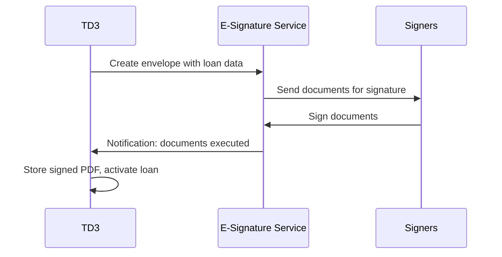
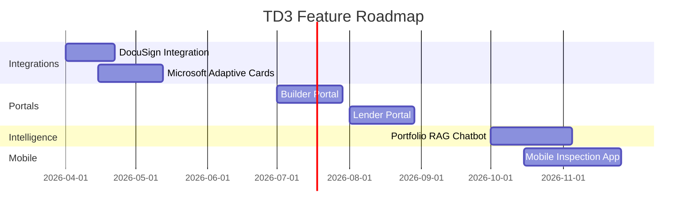

# TD3 Development Roadmap

**Last Updated:** February 2026

---

## Platform Status

TD3's core platform is live and operational:

- Loan lifecycle management (origination through payoff)
- Budget import with AI-powered categorization to industry-standard cost codes
- Draw request processing with automated validation and flagging
- Wire batch funding with consolidated builder payments and audit trail
- Invoice AI extraction and deterministic matching with learning system
- Passwordless authentication with pre-authorized access and stackable permissions
- Row-level database security on all business tables
- Interactive dashboards with portfolio analytics and polymorphic reports
- User preferences (theme, font size, reduced motion, default dashboard)
- Activity tracking with device metadata and complete audit history
- Installable progressive web app with offline-capable assets

---

## Upcoming Features

### DocuSign Integration

Streamline loan origination by integrating electronic signature workflows directly into the platform. When a new loan is created, TD3 will automatically populate document templates with loan data and send them for signature. Once all parties have signed, the executed documents are stored in the loan record and the loan status advances automatically.

This eliminates manual document preparation, reduces turnaround time, and ensures every loan has a complete, tamper-evident document trail.

### Microsoft Adaptive Cards

Enable workflow notifications and approvals directly within the team's existing communication tools. Interactive cards embedded in emails and chat messages allow team members to take action without switching to the TD3 interface.

**Key use cases:**

- **Funding requests** -- Bookkeeper receives a card with builder name, amount, and account details. They input the funding date directly in the card, which feeds back to TD3.
- **Payoff approvals** -- Approver reviews the payoff breakdown and approves or rejects with comments.
- **Draw notifications** -- Processor receives a summary card with flags and a quick-approve button, with a deep link to the full review page.

### Builder & Lender Portals

Provide external stakeholders with secure, limited-access views into their relevant data:

**Builder Portal:**
- View their own loans and current balances
- Review approved budgets by category
- Submit draw requests and upload invoices
- Track draw status through the funding pipeline

**Lender Portal:**
- Read-only portfolio view filtered to their funded loans
- Loan summaries with current balances and draw progress
- Aggregate portfolio statistics and performance metrics
- Exportable reports for internal lending reviews

Both portals will use the existing authentication system extended with role-based access controls and row-level security filtering.

### Portfolio Intelligence (RAG Chatbot)

A natural-language query interface that allows users to ask questions about their portfolio data:

- "What's the total outstanding balance across all active loans?"
- "Show me draws funded this month for Builder X"
- "Which loans are approaching maturity?"
- "Compare budget utilization across active projects"

The chatbot will translate questions into database queries, present results in formatted tables and summaries, and support multi-step analytical reasoning for complex questions.

### Mobile Inspection App

A standalone mobile application for field team members conducting on-site construction inspections:

- **Map view** showing all active project locations with navigation
- **Inspection checklists** comparing draw request items against visible construction progress
- **Photo capture** with annotations tied to specific projects and budget categories
- **GPS tagging** for automatic location verification
- **Offline support** for areas with poor connectivity, with automatic sync when connection is restored
- **Integration with TD3** -- inspection records, photos, and notes appear in the project detail view

---

## Feature Timeline

---

&copy; 2024-2026 Tennant Developments. All rights reserved.
